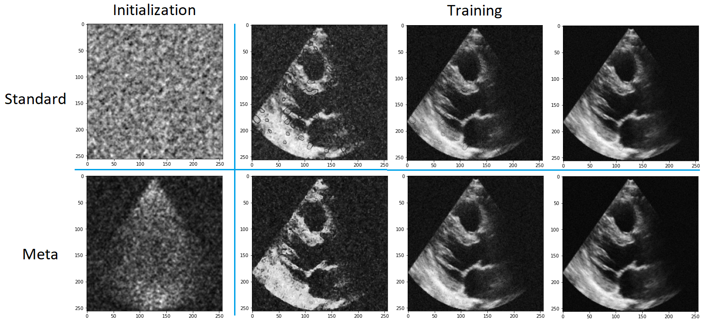

# NeuralField3DUS
NeuralField3DUS - Learning Neural Field Representations for 3D Ultrasound

3D representation:

Meta-learning:

Required software packages:
- pytorch GPU
- numpy
- matplotlib
- PIL
- scipy
- wandb

To run, launch train_3dus.py or train_image_regression.py
Change path to datasets in dataloader.get_dataset_paths
Modify the config_dict to turn off meta-learning
